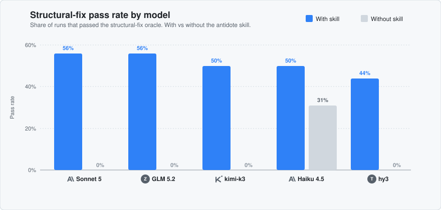

# root-cause

[](./LICENSE)

> Catch and fix AI-written patchwork code before it ships, in any language or stack.

AI agents patch symptoms by default — a bug appears, they add a guard, the bug returns on the next code path that forgets the guard. `root-cause` steers the agent to the **structural fix** instead: a stricter type, a deleted code path, a shared implementation, occasionally a library. The bug becomes **impossible**, not just currently prevented.

The skill prompt and its rules live in [`skills/root-cause/SKILL.md`](./skills/root-cause/SKILL.md). This README covers why you'd install it, the benchmark results, and how to install it.

---

## Benchmark

The skill was tested with the [skill-eval-harness](https://github.com/adewale/skill-eval-harness) across five models. Each test gives the model bugged code and asks it to fix the root cause; a script oracle compiles and runs the output to check that the fix is structural, not a patch. Four cases, 2 runs per arm. Pass rate = share of runs that passed the oracle.



<details>
<summary>Raw numbers</summary>

| Model | With skill | Without skill | Improvement |
|---|---|---|---|
| Claude Sonnet 5 | 56% | 0% | **+56 points** |
| GLM 5.2 | 56% | 0% | **+56 points** |
| moonshotai/kimi-k3 | 50% | 0% | **+50 points** |
| Claude Haiku 4.5 | 50% | 31% | **+19 points** |
| tencent/hy3 | 44% | 0% | **+44 points** |

</details>

Four of the five models passed zero runs without the skill — they patch symptoms by default. With the skill, they find the structural fix instead. Full methodology and reproduction commands: [`docs/benchmark.md`](./docs/benchmark.md).

---

## Install

This skill follows the open [Agent Skills](https://agentskills.io) standard. It works in Claude Code, Codex, Cursor, Devin, Cline, GitHub Copilot, and other popular AI coding platforms.

### Universal (recommended)

```bash
npx skills add Avtr99/root-cause
```

This command detects supported agents on your machine and installs the skill into each agent's native skills directory.

```bash
npx skills add Avtr99/root-cause --global          # all projects, not just this one
npx skills add Avtr99/root-cause --skill root-cause # install only this skill
npx skills add Avtr99/root-cause --list             # preview without installing
```

### Claude Code

```bash
claude plugin marketplace add Avtr99/root-cause
claude plugin install root-cause@avtr-root-cause
```

### Codex / ChatGPT

```bash
codex plugin marketplace add Avtr99/root-cause
codex plugin install root-cause@avtr-root-cause
```

Then install from the Plugins directory in ChatGPT Work or the Codex desktop app.

### GitHub Copilot CLI

```bash
copilot plugin marketplace add Avtr99/root-cause
copilot plugin install root-cause@avtr-root-cause
```

### Cursor

```bash
cursor plugin install Avtr99/root-cause
```

### Devin

```bash
devin plugins install Avtr99/root-cause
```

Verify with `devin plugins list`. Plugins load at session start, so start a new Devin session after installing.

### Grok Build CLI

```bash
grok plugin marketplace add Avtr99/root-cause
grok plugin install root-cause@avtr-root-cause
```

Or install directly: `grok plugin install Avtr99/root-cause`.

### Manual

Copy [`skills/root-cause/`](./skills/root-cause/) into the skills directory of your agent:

| Agent | Path |
|---|---|
| Claude Code | `.claude/skills/root-cause/` |
| Codex | `.agents/skills/root-cause/` |
| Cursor | `.cursor/skills/root-cause/` |
| Devin | `.devin/skills/root-cause/` |
| Generic / cross-agent | `.agents/skills/root-cause/` |

---

## Usage

The skill activates on its own when the agent writes or reviews code. You can also invoke it by name:

- **Slash command** (Claude Code, Codex, Cursor, Devin): `/root-cause`
- **Natural language:** "use root-cause", "audit for overcomplication", "find the root cause"

It has two modes — **fix** (one bug) and **audit** (a whole codebase) — described in [`SKILL.md`](./skills/root-cause/SKILL.md).

## What is inside

| File | Purpose |
|---|---|
| [`skills/root-cause/SKILL.md`](./skills/root-cause/SKILL.md) | The skill — the prompt that the agent reads |
| [`skills/root-cause/README.md`](./skills/root-cause/README.md) | Human-facing docs for the skill |
| [`plugin.json`](./plugin.json) | Root plugin manifest (Devin, Antigravity, and other root-native agents) |
| [`.claude-plugin/marketplace.json`](./.claude-plugin/marketplace.json) | Claude Code plugin marketplace manifest |
| [`.claude-plugin/plugin.json`](./.claude-plugin/plugin.json) | Claude Code plugin manifest |
| [`.codex-plugin/plugin.json`](./.codex-plugin/plugin.json) | Codex / ChatGPT plugin manifest |
| [`.agents/plugins/marketplace.json`](./.agents/plugins/marketplace.json) | Codex / ChatGPT plugin marketplace manifest |
| [`.github/plugin/marketplace.json`](./.github/plugin/marketplace.json) | GitHub Copilot CLI plugin marketplace manifest |
| [`.cursor-plugin/plugin.json`](./.cursor-plugin/plugin.json) | Cursor plugin manifest |
| [`.devin-plugin/plugin.json`](./.devin-plugin/plugin.json) | Devin plugin manifest |
| [`.grok-plugin/plugin.json`](./.grok-plugin/plugin.json) | Grok Build plugin manifest |
| [`.grok-plugin/marketplace.json`](./.grok-plugin/marketplace.json) | Grok Build plugin marketplace manifest |
| [`docs/agent-portability.md`](./docs/agent-portability.md) | Which adapter each host uses |
| [`docs/benchmark.md`](./docs/benchmark.md) | Evaluation methodology and results |

## Compatibility

`root-cause` is a pure-prompt skill. It has no scripts, no network calls, and no dependencies. It works in any agent that reads the `SKILL.md` format. The adapter manifests in this repo (`.claude-plugin/`, `.codex-plugin/`, `.cursor-plugin/`, `.devin-plugin/`, `.grok-plugin/`, `.github/plugin/`) add native install support on top.

## License

MIT — see [LICENSE](./LICENSE).
